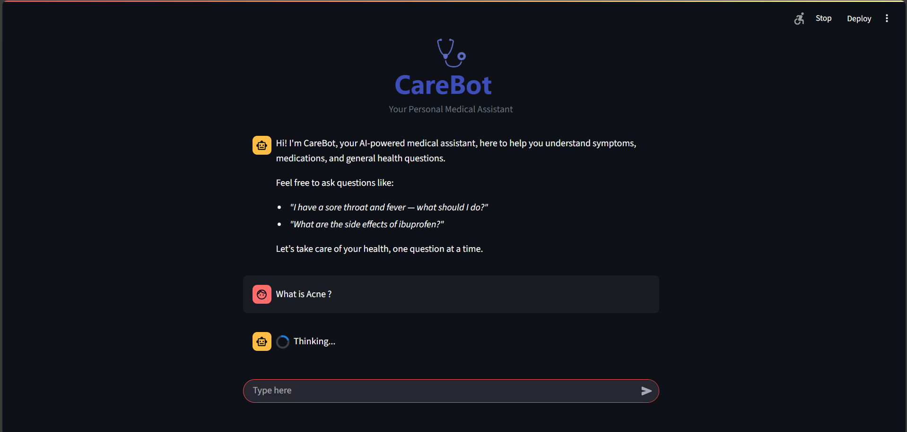
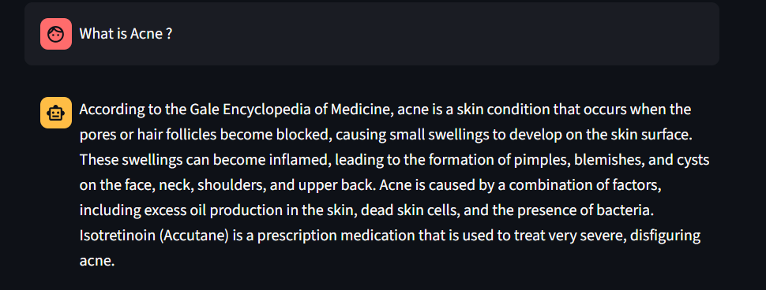

# CareBot: A Medical RAG-based Chatbot
CareBot is a Retrieval-Augmented Generation (RAG) chatbot designed to answer medical questions using the Gale Encyclopedia of Medicine as its knowledge base. It leverages powerful open-source tools such as LangChain, Pinecone, Sentence Transformers, and a quantized LLaMA 2 model to provide informative, contextual responses, all while running efficiently on limited compute.


## Tech Stack 
- LangChain : RAG Pipeline 
- Pinecone : Vector DB
- HuggingFace: Embedding Model and Quantized LLM
- Flask: API Backend
- Streamlit: Frontend UI


## Key Features 
- Scalable Vector Search using Pinecone
- Lightweight system with quantized Llama - 2 model 
- End-to-End Pipeline
- Evaluation Pipeline for measuring response quality and chunk relevance.
- Modular design 


## How it Works
1. Medical documents are embedded using a sentence transformer model and stored in Pinecone.

2. A retriever pulls the top-k relevant chunks based on the query.

3. A quantized LLaMA-2 model generates grounded answers using the context.

4. Responses are evaluated using BERTScore and natural language inference (NLI).


## Streamlit App Screenshots
<p float="left">
  
  
</p>

## Setup & Run
1. Clone the repository
```
   git clone <repo-url>
```

2. Install dependencies:
```
pip install -r requirements.txt
```

3. Set up API keys in .env file (Pinecone and HuggingFace).

4. Run Backend
```
cd src/backend
python backend.py
```

5. Run Streamlit App
```
cd src/frontend
streamlit run app.py
```


